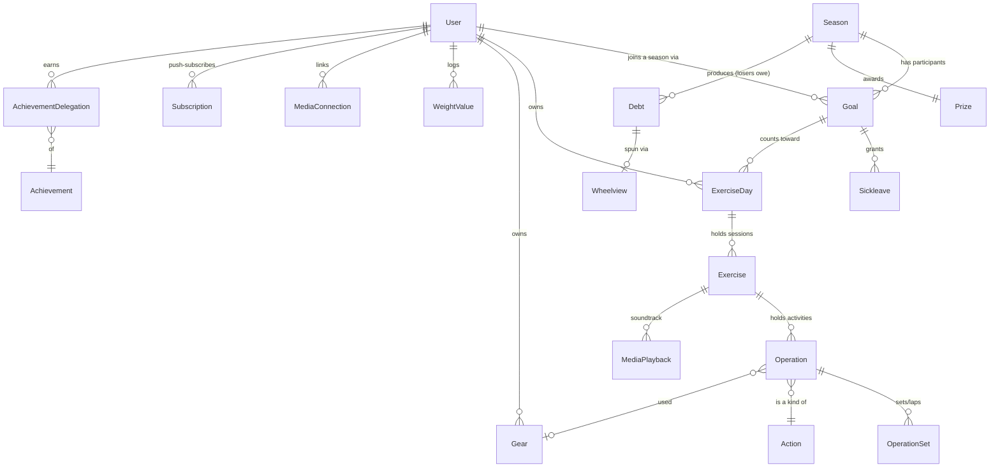

# Data model

What the core entities **are** and how they **relate** — the map to read before
touching the data layer. For the *gotchas* that bite when you read/write this data (the
`Convert*Object` layer's semantics, durations-as-seconds, per-operation units, soft
deletes) see [data-conventions.md](data-conventions.md); this doc is the entity
reference those conventions apply to.

Scope: the **stable domain spine** (the entities the app is built around). Integration
models (Strava/Hevy/OAuth/PAT/MCP) are listed as pointers to their own docs rather than
re-documented here — they change more often and are covered in depth elsewhere.

## The three struct flavors

Almost every entity exists as up to three Go structs. Knowing which one you're holding
matters:

| Flavor | Name pattern | What it is | Where |
| --- | --- | --- | --- |
| **GORM model** | `Exercise` | The persisted table row. `AutoMigrate`d, has GORM tags, foreign keys, `Enabled`, and `models.GormModel` (`ID`, `CreatedAt`, `UpdatedAt`, `DeletedAt`). | `models/`, listed in `database.Migrate()` |
| **Object (read layer)** | `ExerciseObject` | The **canonical read shape**. Built from the model by a `Convert<X>To<X>Object` function that resolves associations, rolls up derived data, and applies fallbacks. Consume these on read paths — don't re-walk raw models. | `models/` (struct) + `controllers/` (`Convert*`) |
| **DTO** | `ExerciseCreationRequest`, `ExerciseUpdateRequest`, `ExerciseDaySummary`, `SeasonListItem` | Request bodies (`…CreationRequest` / `…UpdateRequest`) and slim list/response views that deliberately don't carry the full tree. | `models/` |

Worked example — `Exercise` (a workout session):

- `Exercise` — the row: `Note`, `Duration`, `IsOn`, `CountsTowardGoal`, `ExerciseDayID`,
  `HevyWorkoutID`, `MediaRetrievedAt`, …
- `ExerciseObject` — adds `Operations []OperationObject`, rolled-up `StravaID []string`,
  a `Time` resolved with a fallback to the day's date, and the media overlay.
- `ExerciseCreationRequest` / `ExerciseUpdateRequest` — just the client-writable fields.

Rule of thumb: **write** through the model + a `database.…InDB`/`Update…` function;
**read** through the `…Object`. See
[data-conventions.md § The `Convert*Object` read layer](data-conventions.md#the-convertobject-read-layer)
for why the read layer isn't a trivial field copy.

## The domain spine



The **core logging chain** is the important one to internalise:

```
User ─ owns ─▶ ExerciseDay ─ has ─▶ Exercise ─ has ─▶ Operation ─ has ─▶ OperationSet
              (calendar day)      (a session)       (one activity type)  (reps/weight/distance/time)
```

`ExerciseDay` also carries an optional `GoalID`, which is how a day's exercises "count
toward" a season goal. Everything from `Operation` down is what the statistics, streak,
Strava and media features read.

## Entity reference

### Participation & competition

- **User** (`models/user.go`) — the account. Beyond auth fields it stores integration
  state (`StravaCode`/`StravaID`, `HevyAPIKey`, …), wheel appearance
  (`WheelColor`/`WheelBorderColor`/`WheelEmoji`, see
  [wheel-customization.md](wheel-customization.md)), and share toggles
  (`ShareActivities`/`ShareStatistics`). `HevyConnected` is `gorm:"-"` (computed, not
  stored). Credential fields are `json:"-"`.
- **Season** (`models/season.go`) — a time-boxed competition (`Start`/`End`), a
  `Sickleave` allowance, an awarded `Prize`, and `JoinAnytime`. See
  [seasons-and-goals.md](seasons-and-goals.md).
- **Goal** (`models/goal.go`) — **one user's participation in one season** (the join
  row). Holds the weekly `ExerciseInterval` (target workouts/week) and whether the user
  is `Competing`. `GoalObject` adds the computed `SickleaveLeft`. A user has one goal
  per season joined.
- **Sickleave** (`models/sickleave.go`) — a used/available sick-leave token for a
  `Goal` on a `Date`. Excuses a week from breaking a streak.
- **Prize** (`models/prize.go`) — the reward a season awards (`Name`, `Quantity`).
- **Debt** (`models/debt.go`) — a `Loser` owes a `Winner` within a `Season`; drives the
  wheel-of-fortune. `Winner` is nullable until the wheel is spun.
- **Wheelview** (`models/wheelview.go`) — tracks that a user has seen/spun the wheel for
  a given `Debt`.

### Logging (the core chain)

- **ExerciseDay** (`models/exercise.go`) — a **calendar day** of training for a user
  (the `/exercises/:id` builder). Optional `GoalID` ties the day to a season goal.
  `ExerciseDayObject.ExerciseInterval` is the count of enabled/on exercises;
  `ExerciseDaySummary` is the slim list view.
- **Exercise** (`models/exercise.go`) — **one session** within a day (several per day
  allowed). `Duration` is `*time.Duration` holding **seconds**.
  `MediaRetrievedAt`/`MediaSettled` guard the soundtrack pull (see [media.md](media.md)).
  The soundtrack and Strava streams attach here, at the session grain. A session carries
  **three independent booleans** — don't conflate them:
  - `Enabled` — hard soft-delete (GORM level); a disabled row is gone from every read.
  - `IsOn` — a **reversible builder soft-delete**. Turning a session off in the
    `/exercises/:id` builder keeps the row (it still shows as a struck-out session with
    its operations, and can be turned back on) but removes it from activity + goal counts.
  - `CountsTowardGoal` — whether the session **tallies toward the weekly goal, season
    streak and personal streak**. Distinct from `IsOn`: a session can be fully on and
    visible in the activity feed yet not count (e.g. an imported walk). Snapshotted at
    creation (manual sessions default `true`); later flipped via the builder toggle. The
    goal-counting DB queries (`GetValidExercises…` in `database/exerciseday.go`) filter
    `enabled=1 AND is_on=1 AND counts_toward_goal=1`; the in-memory equivalent is
    `exerciseCountsTowardGoal` in `controllers/exercise.go`.
- **Operation** (`models/operation.go`) — **one activity type** inside a session (a run,
  a lift). Points at an `Action` and optionally a `Gear`. Carries per-operation
  `WeightUnit`/`DistanceUnit` (free-form — never blindly sum across them), `Tags`
  (`TagList`, JSON column), and `Duration` (seconds).
- **OperationSet** (`models/operation.go`) — a **set / lap** of an operation:
  `Repetitions`, `Weight`, `Distance`, `Time`/`MovingTime` (both seconds), plus the
  Strava per-set data (`StravaStreams` JSON blob, retrieval guards). This is the leaf
  where the raw numbers live.
- **Action** (`models/operation.go`) — the **catalog** of activity types (run, bench
  press, …): names (incl. `NorwegianName`, `StravaName`, `HevyTemplateID` for import
  mapping), `Type`, `BodyPart`, `HasLogo`. Shared reference data, not per-user.
- **Gear** (`models/gear.go`) — a piece of equipment (shoe/bike) a user logs against,
  linked per-operation via `Operation.GearID`. Total distance is **computed** from
  linked operations, not stored (`GearObject.Distance`). See [gear.md](gear.md).
- **UserActivityGoalSetting** (`models/useractivitygoalsetting.go`) — a per-user, per-`Action`
  opt-out from goal counting. A `CountsTowardGoal=false` row means "imports of this activity
  type don't count toward my goal by default"; absence of a row = counts. Sync-agnostic (keyed
  on `Action`, applied by both Strava and Hevy import), snapshotted onto `Exercise.CountsTowardGoal`
  at import time — later edits don't retro-apply. Replaces the old `User.StravaIgnoreWalks` flag.
- **Tags** (`models/tag.go`) — not a table: a controlled vocabulary (`ValidTags`) stored
  as a JSON `TagList` on `Operation`. `StravaManagedTags` are owned by Strava on sync;
  the rest are user-controlled and preserved across syncs.

### Per-user extras

- **WeightValue** (`models/weight.go`) — a bodyweight log point (`Date`, `Weight`).
- **MediaConnection** / **MediaPlayback** (`models/media.go`) — per-(user, provider)
  account link and the per-session listening timeline. Credentials are `json:"-"` and
  encrypted at rest. Full design in [media.md](media.md).
- **Achievement** / **AchievementDelegation** (`models/achievement.go`) — the
  achievement catalog and the award of one to a user (`GivenAt`, `Seen`).
- **Subscription** (`models/notification.go`) — a Web Push subscription plus its
  per-category alert toggles.
- **Invite** (`models/invite.go`) — a signup invite `Code`, optionally tied to a
  `Recipient`.
- **News** (`models/news.go`) — an admin-posted news/changelog entry.

### Integration & infrastructure models (documented elsewhere)

These are part of `database.Migrate()` but covered by their feature docs — start there
rather than here:

| Models | Doc |
| --- | --- |
| `OAuthClient`, `OAuthAuthorizationCode`, `OAuthRefreshToken` | [oauth.md](oauth.md) |
| `PersonalAccessToken` | [pat.md](pat.md) |
| Strava sync structs, `StravaStreamsJSON` | [strava.md](strava.md) |
| Hevy sync structs | [hevy.md](hevy.md) |
| MCP request/response shapes | [mcp.md](mcp.md) |
| `Config` and friends | `models/config.go` |

## Where the canonical list lives

`database.Migrate()` in `database/client.go` is the authoritative list of persisted
models (GORM `AutoMigrate`, run at startup — there are no migration files). When you add
a model, register it there; data backfills go in `utilities/migrate.go`. See
[conventions.md § Migrations](conventions.md#migrations).

## Related

- [data-conventions.md](data-conventions.md) — the gotchas that apply to reading/writing
  these entities.
- [conventions.md](conventions.md) — naming, DTO conventions, error handling, migrations.
- [seasons-and-goals.md](seasons-and-goals.md) · [streaks.md](streaks.md) — the domain
  logic that consumes the spine.
